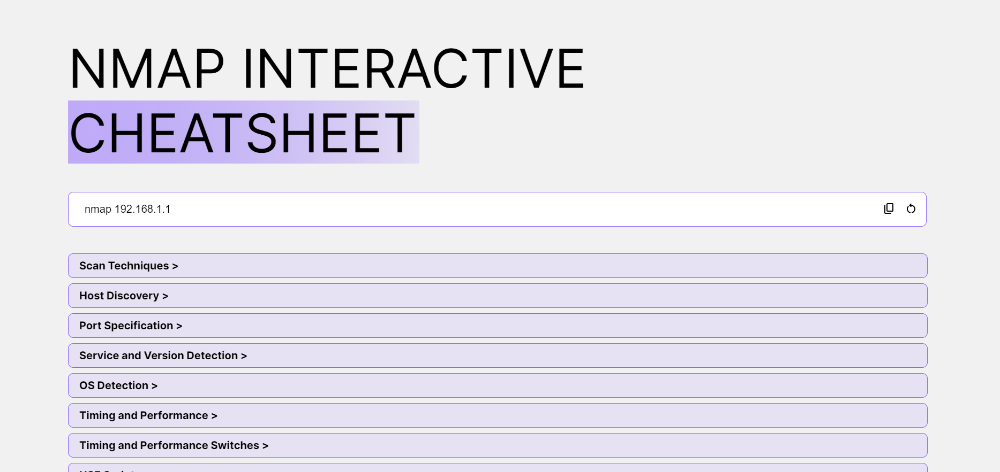

# Nmap interactive cheatsheet

Welcome to the Nmap Interactive Cheatsheet! This HTML document provides an interactive interface for generating Nmap commands with various options. You can customize your Nmap scans by selecting different scan techniques, host discovery methods, port specifications, and more.

## Access

Access via this url `https://antmrlt.github.io/nmap-interactive-cheatsheet/`

## Notes

- This cheatsheet is designed for educational purposes and may not cover all possible options or scenarios.
- Always ensure that you have the right permissions before scanning any network or system.
- Use Nmap responsibly and adhere to applicable laws and regulations.  

Feel free to contribute to this cheatsheet by creating pull requests or suggesting improvements. Happy scanning!